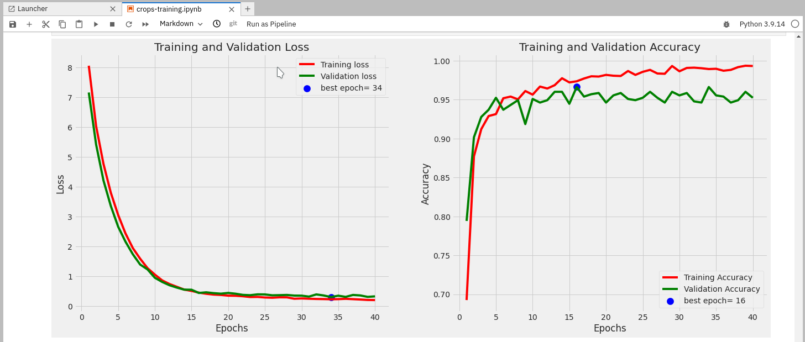
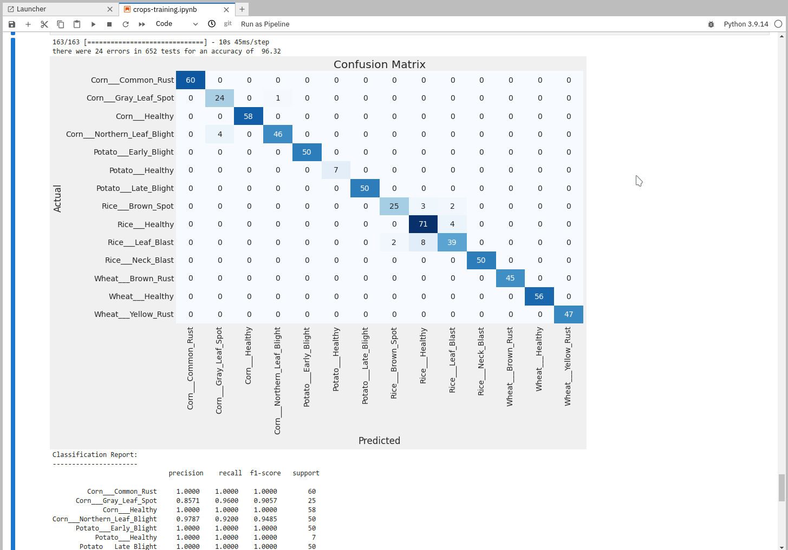
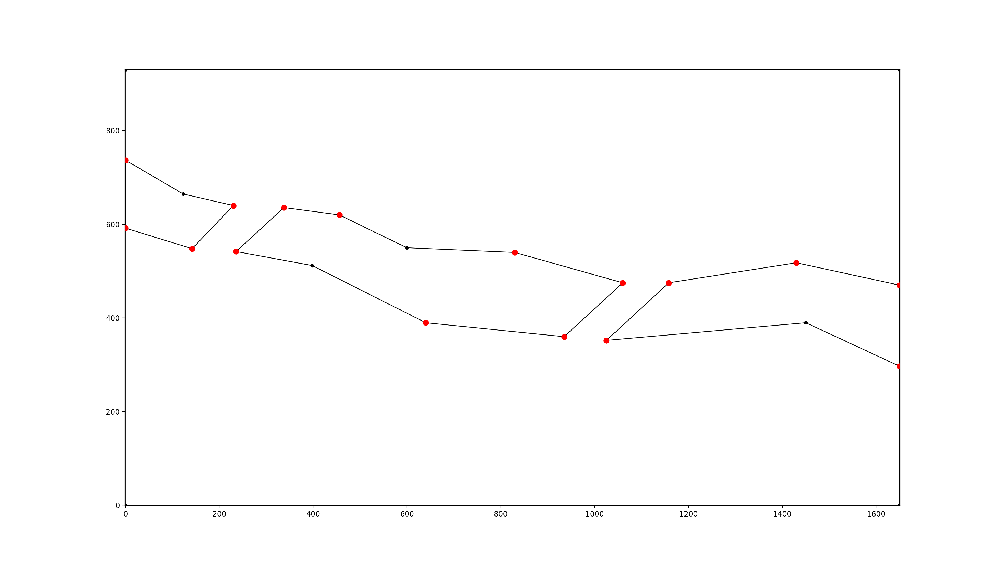
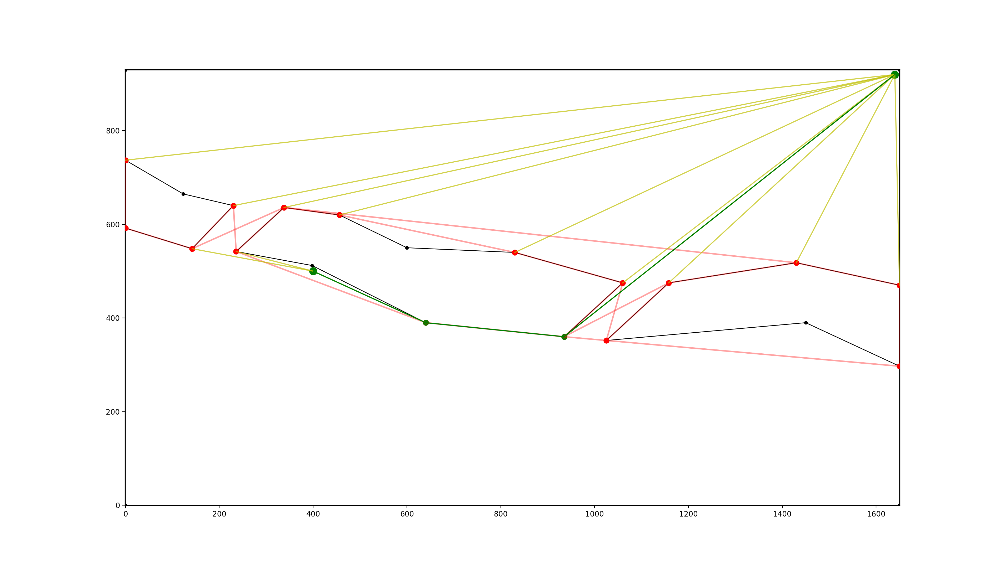
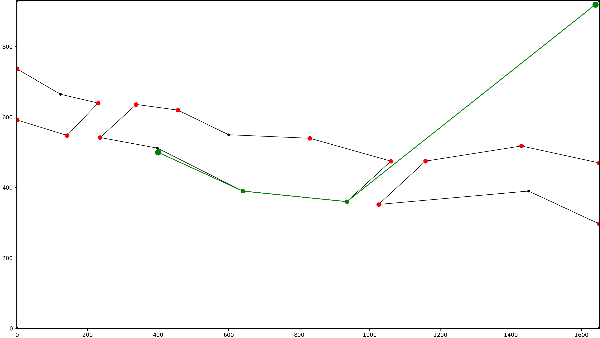
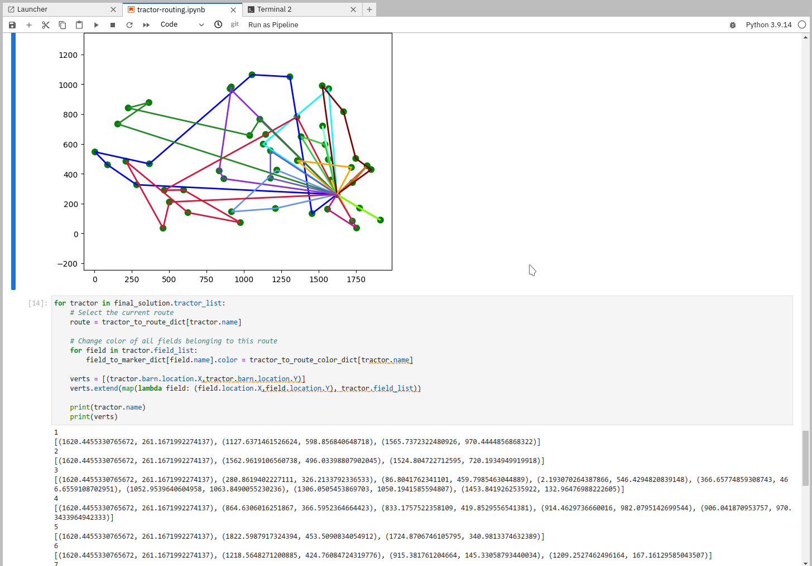
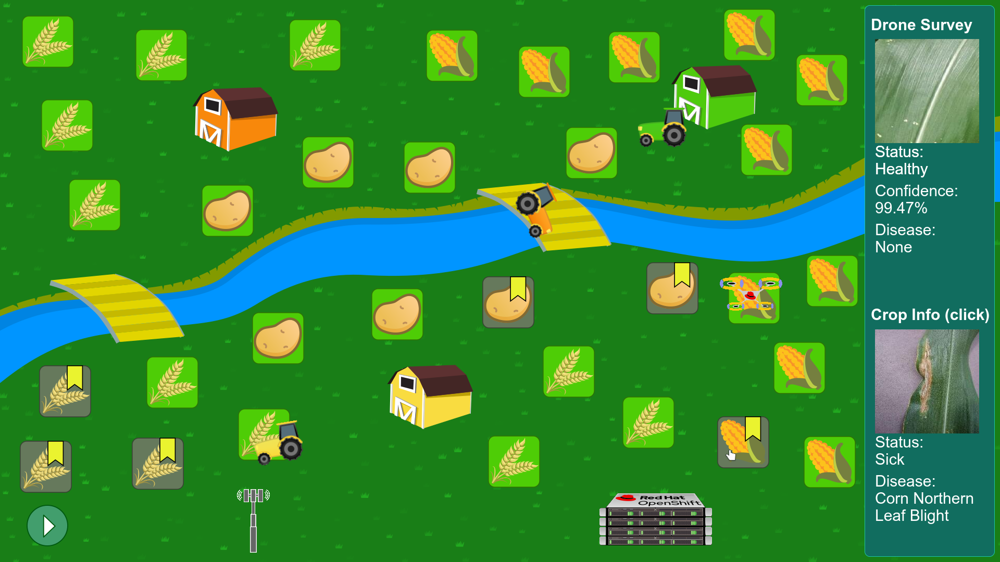
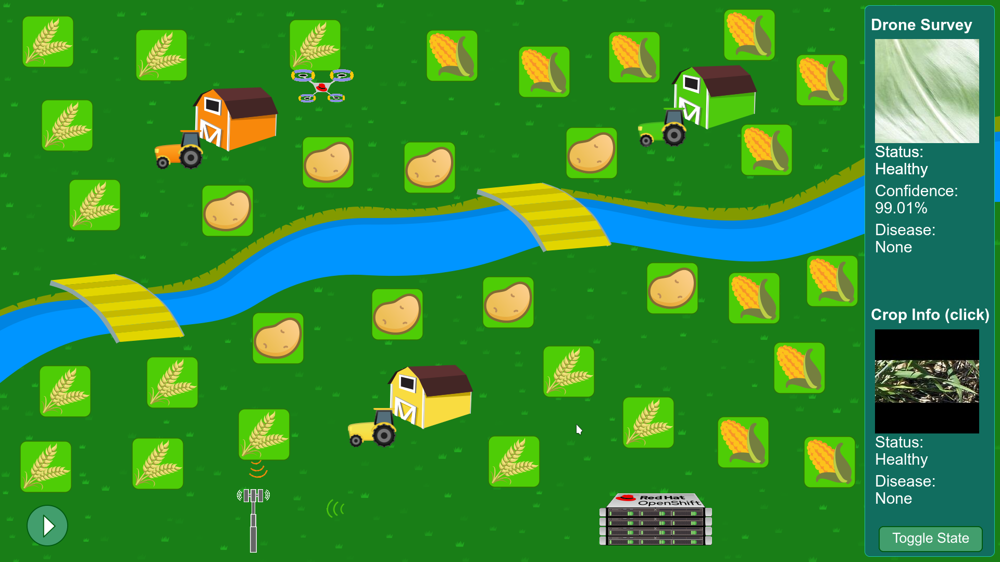
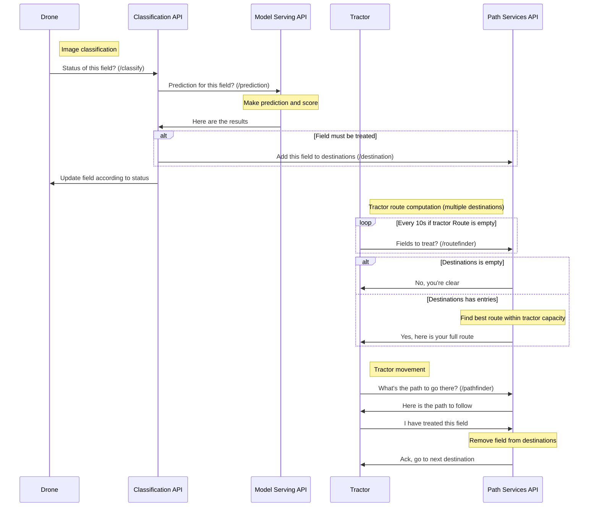

# Intelligent Agriculture Demo

This demo aims at showcasing different technologies in an intelligent agriculture context:

* AI model training and serving for disease recognition in crops
* 5G slices for two way communications between IoT/Field "devices"
* Edge computing at Telco location (MEC)
* Path optimization using Optapy and a PathFinding algorithm
* Automated model updates

## Screenshots

### Training the model

### Path finding

*Defining the obstacles*

*Finding options*

*Optimal path*

### Path optimization

*Optimization with OptaPy*

### Application

*Some crops are ill*

*Everything healthy again*

## Architecture

